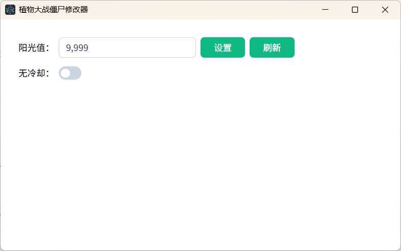

# 🧠 从前端到内存操作：用 Node.js 写《植物大战僵尸》修改器

> 谁说前端只能玩页面交互？
> 本文将带你用 `Node.js` + [`memoryjs`](https://www.npmjs.com/package/memoryjs) 操作经典游戏《植物大战僵尸》的内存，修改阳光值、让植物种植无冷却。
> 不需要 C++，不需要驱动，只要你会 JS，就能一行一行“控制游戏”，轻松写出专属游戏辅助脚本。

---

## 🌱 为什么选择 Node.js + memoryjs？

作者作为一名切图仔，不会C++,不会Lua,只会一点易语言。但使用易语言编写脚本时，总感觉蹩脚得很。
经过我多方打听，终于找到 `memoryjs` 这个库，提供了对 Windows 下进程、模块、内存读写的封装：

```bash
npm install memoryjs
```

推荐使用最新封装编译版本:

```bash
npm install memoryprocess
```

搭配 Electron，你甚至可以给它做个 UI。



---

## 🎮 项目目标

我们以《植物大战僵尸》为例，实现：

1. 实时修改阳光值
2. 一键开启/关闭无冷却
3. Electron实现UI

---

## 🏗️ 基础准备：打开游戏进程

首先我们要“定位游戏进程”并获取它的内存句柄（Handle）：

```ts
const memoryJs = require('memoryjs')

const GameExeName = 'PlantsVsZombies.exe'

function getGameProcessHandler() {
    const process = memoryJs.openProcess(GameExeName)
    if (!process) throw new Error('请先打开游戏')
    return process
}
```

调用 `openProcess` 会返回目标进程的 ID、句柄等信息，后续所有内存读写都依赖它。

---

## 🧩 结构分析：找到目标地址

游戏的数据（比如阳光值）并不是固定地址，而是通过 **模块基地址 + 偏移链** 来定位的：

```ts
/**
 * 获取模块基地址
 */
function getModuleBaseAddr(process, moduleName = GameExeName) {
    const modules = memoryJs.getModules(process.th32ProcessID)
    const mod = modules.find((m) => m.szModule.toLowerCase() === moduleName)
    return mod?.modBaseAddr
}

/**
 * 计算偏移后的地址
 */
function resolveAddr(process, baseAddr, offsets) {
    let addr = memoryJs.readMemory(process.handle, baseAddr, 'dword')
    for (let i = 0; i < offsets.length - 1; i++) {
        addr = memoryJs.readMemory(process.handle, addr + offsets[i], 'dword')
    }
    return addr + offsets[offsets.length - 1]
}
```

---

## 🌞 示例一：设置阳光值

通过配置管理偏移结构：

```ts
/**
 * 关卡阳光的基地址为：[[[Game.exe + 0x2a9f38] + 0x768] + 0x5560]
 */
const GameConfig = {
    set_sunshine: {
        baseOffset: 0x2a9f38, // 例如 Game.exe + 0x2a9f38
        offsets: [0x768, 0x5560], //两次偏移，分别是 0x768,0x5560
        type: 'dword'
    }
}

/**
 * 设置阳光值
 */
function Game_SetSunshine(value) {
    // 先获取进程句柄
    const process = getGameProcessHandler()
    // 获取进程模块基地址
    const base = getModuleBaseAddr(process)
    // 获取阳光的地址
    const addr = resolveAddr(
        process,
        base + GameConfig.set_sunshine.baseOffset,
        GameConfig.set_sunshine.offsets
    )
    // 向这个内存地址写入新的阳光值
    memoryJs.writeMemory(process.handle, addr, value, 'dword')
    // 关闭进程句柄
    memoryJs.closeHandle(process.handle)
}
```

👆 运行 `Game_SetSunshine(9999)` 就能瞬间让你财大气粗！

---

## ❄️ 示例二：开启无冷却

相较于修改阳光值，无冷却功能需要我们覆盖游戏某段指令(即修改源代码)，通过写入汇编字节实现功能开启：

```ts
function Game_SetCoolDown(open) {
    const process = getGameProcessHandler()
    const addr = getModuleBaseAddr(process) + 0x87296 // 冷却相关地址
    // addr 便是存储判断冷却的相关代码。
    // 原代码是 0x7E 0x14 --> 修改为 0x7F 0x14
    // 其实就是将判断冷却时间的代码中的 `Jle` 改为了 `Jg`: `小于等于` -> `大于`
    const newBytes = open ? Buffer.from([0x7f, 0x14]) : Buffer.from([0x7e, 0x14])
    memoryJs.writeBuffer(process.handle, addr, newBytes)
    memoryJs.closeHandle(process.handle)
}
```

---

## 🧠 示例三：读取阳光值

你甚至可以把这个值实时展示到 UI（比如 Electron 界面）中：

```ts
function Game_GetSunshine() {
    const process = getGameProcessHandler()
    const base = getModuleBaseAddr(process)
    const addr = resolveAddr(
        process,
        base + GameConfig.set_sunshine.baseOffset,
        GameConfig.set_sunshine.offsets
    )
    const value = memoryJs.readMemory(process.handle, addr, 'dword')
    memoryJs.closeHandle(process.handle)
    return value
}
```

---

## 📁 最佳实践：配合Electron提供操作UI界面

- [https://electron-vite.github.io/](https://electron-vite.github.io/)
- [https://github.com/JoShMiQueL/memoryprocess](https://github.com/JoShMiQueL/memoryprocess)
- [https://github.com/Rob--/memoryjs](https://github.com/Rob--/memoryjs)

---

## ⚠️ 注意事项

- **必须以管理员权限运行 Node 脚本**，否则无法访问游戏内存
- 确保你找到的偏移是当前版本可用的（可配合 Cheat Engine 分析）
- 这是纯学习研究项目，请勿用于非法用途

---

## 🧩 后续拓展方向，欢迎关注

1. 使用Nodejs调用大漠插件
2. 使用Nodejs调用易键鼠的双头盒子虚拟输入dll
3. 大型网游实战

## 🏁 总结

通过 `Node.js + memoryjs`，即使是纯前端背景的开发者也可以轻松进入**内存脚本开发的世界**。利用现代 JS 工具链，我们可以封装一个安全、可维护的辅助工具。

---

如果你也想使用Nodejs来编写游戏修改器或者游戏脚本，欢迎一起讨论！


---

## 附录

- 修改器Demo仓库：[https://github.com/chinjiaqing/pvz-tools](https://github.com/chinjiaqing/pvz-tools)
- 游戏下载地址：[https://www.32r.com/soft/110449.html](https://www.32r.com/soft/110449.html)

### 如何运行demo

1. 克隆仓库
2. 安装依赖，推荐使用`yarn`
   ```bash
    yarn install
   ```
3. 运行
    ```bash
    yarn dev
    ```
4. 打包exe
    ```bash
    yarn build:win
    ```